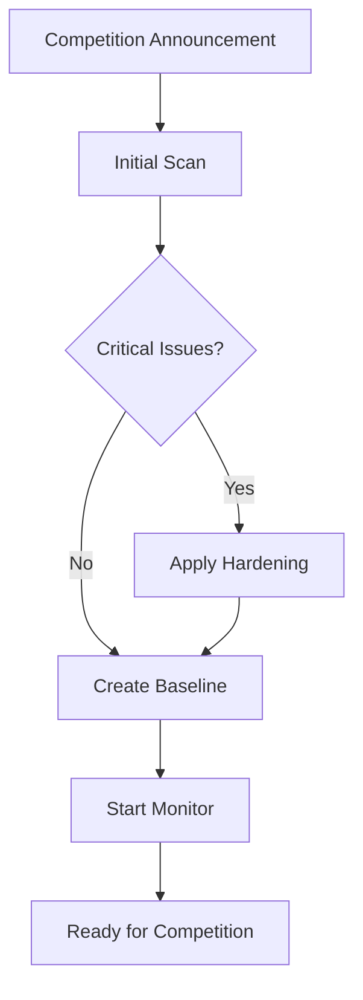
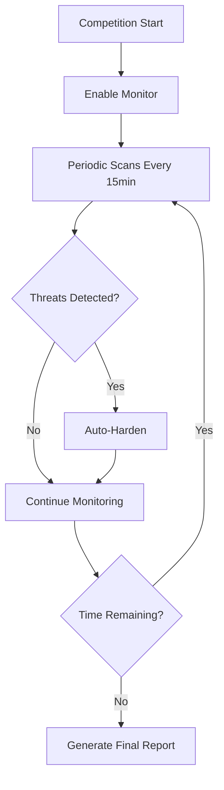

# HexStrike MCP Integration Guide

## Blue Team Agent × HexStrike AI MCP

This guide explains how to use the Blue Team Automation Agent through the HexStrike AI MCP (Model Context Protocol) interface, allowing AI agents like Claude, GPT-4, and GitHub Copilot to perform autonomous Blue Team operations.

---

## Table of Contents

1. [Overview](#overview)
2. [Architecture](#architecture)
3. [Setup & Installation](#setup--installation)
4. [Available MCP Tools](#available-mcp-tools)
5. [Usage Examples](#usage-examples)
6. [AI Agent Workflows](#ai-agent-workflows)
7. [Competition Mode](#competition-mode)
8. [Troubleshooting](#troubleshooting)

---

## Overview

### What is MCP Integration?

The Blue Team Agent is now integrated with HexStrike AI's MCP server, enabling:

- **🤖 AI-Powered Blue Team Operations** - AI agents can autonomously run security scans, harden systems, and monitor threats
- **🔄 Unified Security Platform** - Combine Red Team (HexStrike) and Blue Team tools in one interface
- **📊 Real-Time Intelligence** - AI agents receive live security alerts and can respond automatically
- **🏆 Competition Automation** - Perfect for CEG25 and other Blue Team competitions

### Integration Benefits

```
┌─────────────────────────────────────────────────────────────────┐
│                     AI Agent (Claude/GPT/Copilot)               │
│                                                                 │
│  "Scan the system, harden it, and start monitoring for         │
│   threats in competition mode for the next 2 hours"            │
└────────────────────────────┬────────────────────────────────────┘
                             │ MCP Protocol
                             ↓
┌─────────────────────────────────────────────────────────────────┐
│              HexStrike AI MCP Server (Port 8888)                │
│                                                                 │
│  ┌─────────────────────────────────────────────────────────┐   │
│  │ Blue Team Tools (7 Functions):                          │   │
│  │  • blue_team_scan()          • blue_team_monitor_*()    │   │
│  │  • blue_team_harden()        • blue_team_report()       │   │
│  │  • blue_team_compete()                                  │   │
│  └─────────────────────────────────────────────────────────┘   │
│                                                                 │
│  ┌─────────────────────────────────────────────────────────┐   │
│  │ Red Team Tools (150+ Functions):                        │   │
│  │  • nmap_scan()     • nuclei_scan()    • sqlmap_scan()   │   │
│  │  • gobuster_scan() • burpsuite_*()    • ...             │   │
│  └─────────────────────────────────────────────────────────┘   │
└────────────────────────────┬────────────────────────────────────┘
                             │ API Endpoints
                             ↓
┌─────────────────────────────────────────────────────────────────┐
│          Blue Team Agent (CEG25/blue-team-toolkit)              │
│                                                                 │
│  ┌─────────────┐  ┌──────────────┐  ┌─────────────────────┐   │
│  │  4 Modules  │  │  8 Scanners  │  │  5 Monitor Domains  │   │
│  │  • scan     │  │  • SUID      │  │  • File Integrity   │   │
│  │  • harden   │  │  • Files     │  │  • Processes        │   │
│  │  • monitor  │  │  • Ports     │  │  • Network          │   │
│  │  • report   │  │  • Users     │  │  • Users            │   │
│  └─────────────┘  │  • ...       │  │  • SUID             │   │
│                   └──────────────┘  └─────────────────────┘   │
└─────────────────────────────────────────────────────────────────┘
```

---

## Architecture

### Component Overview

| Component | Location | Purpose |
|-----------|----------|---------|
| **HexStrike MCP Client** | `hexstrike-ai/hexstrike_mcp.py` | MCP protocol implementation with 7 Blue Team tools |
| **HexStrike API Server** | `hexstrike-ai/hexstrike_server.py` | REST API with 8 Blue Team endpoints |
| **Blue Team Agent** | `CEG25/blue-team-toolkit/linux/blue_agent.sh` | Core Bash automation script |
| **AI Configuration** | `~/.config/Claude/claude_desktop_config.json` | AI agent MCP configuration |

### Data Flow

```
AI Request → MCP Protocol → HexStrike Client → REST API → Blue Team Agent → System
    ↓                                                                        ↓
AI Response ← JSON Results ← API Response ← JSON Parse ← Script Output ← Findings
```

---

## Setup & Installation

### Prerequisites

1. **HexStrike AI MCP Server** (already installed at `/home/goodlife/Desktop/hexstrike-ai`)
2. **Blue Team Agent** (already installed at `/home/goodlife/Desktop/CEG25/blue-team-toolkit`)
3. **AI Agent** (Claude Desktop, VS Code Copilot, or compatible MCP client)

### Step 1: Start HexStrike Server

```bash
cd ~/Desktop/hexstrike-ai

# Activate virtual environment
source hexstrike_env/bin/activate

# Start the MCP server
python3 hexstrike_server.py

# Expected output:
# 🚀 Starting HexStrike AI API Server
# 🌐 Port: 8888
# ✨ Enhanced Visual Engine: Active
```

### Step 2: Configure AI Agent

#### For Claude Desktop

Edit `~/.config/Claude/claude_desktop_config.json`:

```json
{
  "mcpServers": {
    "hexstrike-ai": {
      "command": "python3",
      "args": [
        "/home/goodlife/Desktop/hexstrike-ai/hexstrike_mcp.py",
        "--server",
        "http://localhost:8888"
      ],
      "description": "HexStrike AI with Blue Team Operations",
      "timeout": 300,
      "disabled": false
    }
  }
}
```

#### For VS Code Copilot

Add to `.vscode/settings.json`:

```json
{
  "servers": {
    "hexstrike": {
      "type": "stdio",
      "command": "python3",
      "args": [
        "/home/goodlife/Desktop/hexstrike-ai/hexstrike_mcp.py",
        "--server",
        "http://localhost:8888"
      ]
    }
  }
}
```

### Step 3: Restart AI Agent

- **Claude Desktop**: Restart the application
- **VS Code Copilot**: Reload window (Ctrl+Shift+P → "Reload Window")

### Step 4: Verify Integration

Ask your AI agent:

```
"Can you check if HexStrike Blue Team tools are available?"
```

Expected response should show 7 Blue Team functions available.

---

## Available MCP Tools

### 1. `blue_team_scan()`

**Purpose**: Execute comprehensive Linux security scanning

**Parameters**:
- `scan_type` (string): Type of scan - "all", "suid", "files", "ports", "users", "passwords", "ssh", "firewall", "docker"
- `sudo` (boolean): Use sudo privileges (default: true)

**Returns**:
- `success` (boolean): Scan completion status
- `findings` (object): Severity breakdown (critical, high, medium)
- `stdout` (string): Full scan output
- `returncode` (integer): Exit code

**Example**:
```python
# AI agent invokes:
blue_team_scan(scan_type="all", sudo=True)

# Response:
{
  "success": true,
  "scan_type": "all",
  "findings": {
    "critical": 2,
    "high": 5,
    "medium": 8
  },
  "stdout": "...",
  "returncode": 0
}
```

### 2. `blue_team_harden()`

**Purpose**: Execute automated security hardening

**Parameters**:
- `action` (string): Hardening action - "all", "suid", "permissions", "users", "ssh", "firewall", "docker"
- `sudo` (boolean): Use sudo privileges (default: true)
- `backup` (boolean): Create backups before changes (default: true)

**Returns**:
- `success` (boolean): Hardening completion status
- `fixes_applied` (integer): Number of fixes applied
- `stdout` (string): Hardening output

**Example**:
```python
# AI agent invokes:
blue_team_harden(action="all", sudo=True, backup=True)

# Response:
{
  "success": true,
  "action": "all",
  "fixes_applied": 12,
  "stdout": "✅ Fixed 12 security issues..."
}
```

### 3. `blue_team_monitor_start()`

**Purpose**: Start real-time security monitoring

**Parameters**:
- `duration` (integer): Monitoring duration in seconds (0 = indefinite)
- `interval` (integer): Check interval in seconds (default: 10)

**Returns**:
- `success` (boolean): Monitor start status
- `pid` (string): Process ID of monitor
- `log_file` (string): Path to log file

**Example**:
```python
# AI agent invokes:
blue_team_monitor_start(duration=3600, interval=10)

# Response:
{
  "success": true,
  "pid": "12345",
  "duration": 3600,
  "message": "Monitor started successfully",
  "log_file": "~/Desktop/CEG25/blue-team-toolkit/logs/blue_agent.log"
}
```

### 4. `blue_team_monitor_stop()`

**Purpose**: Stop the real-time security monitor

**Parameters**: None

**Returns**:
- `success` (boolean): Stop status
- `message` (string): Confirmation message

**Example**:
```python
# AI agent invokes:
blue_team_monitor_stop()

# Response:
{
  "success": true,
  "message": "Monitor stopped"
}
```

### 5. `blue_team_monitor_status()`

**Purpose**: Check monitor status and view recent alerts

**Parameters**: None

**Returns**:
- `success` (boolean): Query status
- `running` (boolean): Whether monitor is active
- `pid` (string): Process ID (if running)
- `runtime` (string): How long monitor has been running
- `recent_alerts` (integer): Number of recent alerts

**Example**:
```python
# AI agent invokes:
blue_team_monitor_status()

# Response:
{
  "success": true,
  "running": true,
  "pid": "12345",
  "runtime": "15m 30s",
  "recent_alerts": 3
}
```

### 6. `blue_team_report()`

**Purpose**: Generate comprehensive security assessment report

**Parameters**:
- `format_type` (string): Report format - "text", "json", "html"
- `include_recommendations` (boolean): Include remediation steps (default: true)

**Returns**:
- `success` (boolean): Report generation status
- `report_path` (string): Path to generated report
- `summary` (object): Report summary statistics

**Example**:
```python
# AI agent invokes:
blue_team_report(format_type="text", include_recommendations=True)

# Response:
{
  "success": true,
  "format": "text",
  "report_path": "~/Desktop/CEG25/reports/report_20251023_213707.txt",
  "summary": {
    "total_findings": 15,
    "security_score": 85
  }
}
```

### 7. `blue_team_compete()`

**Purpose**: Run full competition mode with automated workflows

**Parameters**:
- `duration` (integer): Competition duration in seconds (default: 3600)
- `auto_harden` (boolean): Auto-apply hardening (default: true)
- `auto_scan_interval` (integer): Rescan interval in seconds (default: 900)

**Returns**:
- `success` (boolean): Competition mode status
- `mode` (string): "competition"
- `status` (string): Current status

**Example**:
```python
# AI agent invokes:
blue_team_compete(duration=7200, auto_harden=True, auto_scan_interval=900)

# Response:
{
  "success": true,
  "mode": "competition",
  "duration": 7200,
  "auto_harden": true,
  "status": "running",
  "message": "Competition mode initiated successfully"
}
```

---

## Usage Examples

### Example 1: Quick Security Assessment

**AI Prompt**:
```
"I need a security assessment of this Linux system. Can you scan for vulnerabilities 
and provide a report?"
```

**AI Agent Workflow**:
```python
# 1. Run comprehensive scan
scan_result = blue_team_scan(scan_type="all", sudo=True)

# 2. Generate report
report_result = blue_team_report(format_type="text", include_recommendations=True)

# 3. Summarize findings for user
print(f"Found {scan_result['findings']['critical']} critical issues")
print(f"Report saved to: {report_result['report_path']}")
```

### Example 2: Automated Hardening

**AI Prompt**:
```
"This system needs immediate hardening. Apply all security fixes and verify."
```

**AI Agent Workflow**:
```python
# 1. Run initial scan
initial_scan = blue_team_scan(scan_type="all", sudo=True)

# 2. Apply hardening
harden_result = blue_team_harden(action="all", sudo=True, backup=True)

# 3. Verify with post-hardening scan
final_scan = blue_team_scan(scan_type="all", sudo=True)

# 4. Compare results
improvement = initial_scan['findings']['critical'] - final_scan['findings']['critical']
print(f"Reduced critical issues by {improvement}")
```

### Example 3: Competition Mode

**AI Prompt**:
```
"Start competition mode for CEG25. Duration 2 hours with auto-hardening enabled 
and rescans every 15 minutes."
```

**AI Agent Workflow**:
```python
# Competition mode handles everything automatically
compete_result = blue_team_compete(
    duration=7200,      # 2 hours
    auto_harden=True,   # Auto-fix issues
    auto_scan_interval=900  # Rescan every 15 min
)

print("Competition mode active! Monitoring for threats...")
```

### Example 4: Real-Time Monitoring

**AI Prompt**:
```
"Start monitoring the system for threats for the next hour and alert me 
if anything suspicious happens."
```

**AI Agent Workflow**:
```python
# 1. Start monitor
monitor_result = blue_team_monitor_start(duration=3600, interval=10)

print(f"Monitor started (PID: {monitor_result['pid']})")
print("Watching for: file changes, suspicious processes, network activity, SUID files")
print(f"Alerts will be logged to: {monitor_result['log_file']}")

# 2. AI agent can periodically check status
status = blue_team_monitor_status()
if status['recent_alerts'] > 0:
    print(f"⚠️ {status['recent_alerts']} alerts detected! Check logs.")
```

### Example 5: Combined Red & Blue Team

**AI Prompt**:
```
"I'm doing a security exercise. First defend this system, then test it with 
a port scan to see if the hardening worked."
```

**AI Agent Workflow**:
```python
# BLUE TEAM: Defend
print("=== BLUE TEAM: DEFENSE ===")
harden_result = blue_team_harden(action="all", sudo=True)
print(f"Applied {harden_result['fixes_applied']} security fixes")

# RED TEAM: Test (using HexStrike tools)
print("\n=== RED TEAM: ATTACK ===")
scan_result = nmap_scan(target="localhost", scan_type="-sS", ports="1-1000")

# BLUE TEAM: Verify
print("\n=== BLUE TEAM: VERIFICATION ===")
verification = blue_team_scan(scan_type="ports", sudo=True)
print("Defense effective!" if verification['findings']['critical'] == 0 else "More hardening needed")
```

---

## AI Agent Workflows

### Workflow 1: Pre-Competition Setup



**AI Commands**:
```python
# 1. Initial assessment
initial_scan = blue_team_scan(scan_type="all")

# 2. Harden system
blue_team_harden(action="all", backup=True)

# 3. Create monitoring baseline
blue_team_monitor_start(duration=60)  # 1 min baseline
time.sleep(60)
blue_team_monitor_stop()

# 4. Ready for competition
print("✅ System hardened and baseline created. Ready for competition!")
```

### Workflow 2: During Competition



**AI Commands**:
```python
# Full automation
blue_team_compete(
    duration=7200,          # 2 hour competition
    auto_harden=True,       # Auto-fix threats
    auto_scan_interval=900  # Rescan every 15 min
)

# AI agent monitors logs and can intervene if needed
```

### Workflow 3: Post-Competition Analysis

```python
# 1. Stop monitoring
blue_team_monitor_stop()

# 2. Final scan
final_scan = blue_team_scan(scan_type="all")

# 3. Generate comprehensive report
report = blue_team_report(format_type="html", include_recommendations=True)

# 4. Summary
print(f"""
Competition Summary:
- Threats Detected: {final_scan['findings']['critical']}
- System Security: {report['summary']['security_score']}/100
- Report: {report['report_path']}
""")
```

---

## Competition Mode

### What It Does

Competition mode automates the entire Blue Team workflow:

1. **Initial Scan** (10 seconds) - Full system security assessment
2. **Auto-Hardening** (30 seconds) - Apply all security fixes
3. **Real-Time Monitoring** (entire duration) - Continuous threat detection
4. **Periodic Rescans** (every 15 minutes) - Catch new threats
5. **Final Report** (end of competition) - Complete security summary

### Usage

```python
# 2-hour competition with full automation
blue_team_compete(
    duration=7200,              # 2 hours (7200 seconds)
    auto_harden=True,           # Automatically fix threats
    auto_scan_interval=900      # Rescan every 15 minutes
)
```

### Monitoring Competition

```bash
# Watch real-time alerts
tail -f ~/Desktop/CEG25/blue-team-toolkit/logs/blue_agent.log | grep -E "🚨|⚠️"

# Check monitor status
# (AI agent does this automatically)
blue_team_monitor_status()
```

### What AI Sees

```
🏆 STARTING CEG25 COMPETITION MODE 🏆
  ⏰ Duration: 7200s (120 minutes)
  🔒 Auto-Harden: ENABLED
  🔄 Scan Interval: 900s

✅ Competition mode initiated
📊 Monitor logs: tail -f logs/blue_agent.log

[15 minutes later]
🔄 Periodic rescan complete
   - 0 new critical issues
   - 1 new medium issue
   - Auto-hardening applied

[30 minutes later]
🚨 ALERT: SUID file detected in /tmp
✅ Auto-hardening removed threat

[Competition end - 2 hours]
📊 Generating final report...
✅ Competition completed
   - Threats blocked: 5
   - Security score: 92/100
   - Report: reports/competition_final_20251023.txt
```

---

## Troubleshooting

### Issue: AI can't see Blue Team tools

**Solution**:
```bash
# 1. Check HexStrike server is running
curl http://localhost:8888/health

# 2. Restart AI agent

# 3. Verify MCP configuration
cat ~/.config/Claude/claude_desktop_config.json
```

### Issue: "Blue Team agent not found" error

**Solution**:
```bash
# Verify agent path
ls -la ~/Desktop/CEG25/blue-team-toolkit/linux/blue_agent.sh

# Update path in hexstrike_server.py if needed
# Line ~17100: agent_path = os.path.expanduser("~/Desktop/CEG25/...")
```

### Issue: Permission denied errors

**Solution**:
```bash
# Ensure sudo permissions for the user
sudo -v

# Check agent is executable
chmod +x ~/Desktop/CEG25/blue-team-toolkit/linux/blue_agent.sh
```

### Issue: Monitor not starting

**Solution**:
```bash
# Check if monitor is already running
ps aux | grep blue_agent

# Stop existing monitor
sudo ~/Desktop/CEG25/blue-team-toolkit/linux/blue_agent.sh monitor stop

# Try starting again
blue_team_monitor_start(duration=300)
```

### Issue: Slow performance

**Solution**:
```bash
# Check system resources
top

# Reduce scan frequency
blue_team_compete(
    duration=3600,
    auto_scan_interval=1800  # Scan every 30 min instead of 15
)
```

---

## Advanced Features

### Custom Competition Workflows

You can create custom workflows by combining Blue Team tools:

```python
# Example: Progressive Hardening Strategy
def progressive_hardening():
    # Phase 1: Quick wins (5 seconds)
    blue_team_harden(action="suid")
    blue_team_harden(action="permissions")
    
    # Phase 2: User security (10 seconds)
    blue_team_harden(action="users")
    
    # Phase 3: Network hardening (15 seconds)
    blue_team_harden(action="ssh")
    blue_team_harden(action="firewall")
    
    # Phase 4: Container security (20 seconds)
    blue_team_harden(action="docker")
    
    print("✅ Progressive hardening complete in 50 seconds")
```

### Integration with Other HexStrike Tools

```python
# Example: Verify hardening with vulnerability scan
def verify_hardening():
    # Apply hardening
    blue_team_harden(action="all")
    
    # Verify with external tools
    nuclei_scan(target="localhost", severity="critical,high")
    nmap_scan(target="localhost", scan_type="-sV")
    
    # Generate comparison report
    report = blue_team_report(format_type="html")
    print(f"Hardening verification complete: {report['report_path']}")
```

---

## API Reference

### REST API Endpoints

All Blue Team functions are accessible via REST API:

| Endpoint | Method | Description |
|----------|--------|-------------|
| `/api/blueteam/scan` | POST | Execute security scan |
| `/api/blueteam/harden` | POST | Apply hardening |
| `/api/blueteam/monitor/start` | POST | Start monitoring |
| `/api/blueteam/monitor/stop` | POST | Stop monitoring |
| `/api/blueteam/monitor/status` | GET | Check monitor status |
| `/api/blueteam/report` | POST | Generate report |
| `/api/blueteam/compete` | POST | Start competition mode |

### Example cURL Commands

```bash
# Scan system
curl -X POST http://localhost:8888/api/blueteam/scan \
  -H "Content-Type: application/json" \
  -d '{"scan_type": "all", "sudo": true}'

# Start monitoring
curl -X POST http://localhost:8888/api/blueteam/monitor/start \
  -H "Content-Type: application/json" \
  -d '{"duration": 3600, "interval": 10}'

# Check status
curl http://localhost:8888/api/blueteam/monitor/status
```

---

## Performance Metrics

### Typical Execution Times

| Operation | Duration | Notes |
|-----------|----------|-------|
| **Scan (all)** | 30-45 seconds | Full system scan |
| **Scan (specific)** | 5-10 seconds | Single module |
| **Harden (all)** | 15-30 seconds | All fixes |
| **Harden (specific)** | 3-8 seconds | Single module |
| **Monitor start** | <2 seconds | Background process |
| **Report generation** | 5-10 seconds | Text format |

### Resource Usage

| Component | CPU | Memory | Disk I/O |
|-----------|-----|--------|----------|
| **HexStrike Server** | <5% | 50-100MB | Low |
| **Blue Team Agent** | 2-8% | 10-20MB | Medium |
| **Monitor (active)** | <1% | 10-20MB | Low |

---

## Security Considerations

### Sudo Permissions

All Blue Team operations require sudo. Ensure your AI agent's service account has:

```bash
# Add to /etc/sudoers
username ALL=(ALL) NOPASSWD: /path/to/blue_agent.sh
```

### Log Security

Logs contain sensitive security information:

```bash
# Secure logs directory
chmod 700 ~/Desktop/CEG25/blue-team-toolkit/logs
```

### API Security

For production use, add authentication to HexStrike server:

```python
# In hexstrike_server.py
@app.before_request
def require_api_key():
    api_key = request.headers.get('X-API-Key')
    if api_key != os.environ.get('HEXSTRIKE_API_KEY'):
        return jsonify({"error": "Unauthorized"}), 401
```

---

## Future Enhancements

### Planned Features

- **Real-time Webhooks**: Push alerts to external systems
- **Multi-System Support**: Manage multiple systems from one AI agent
- **ML Threat Detection**: AI-powered anomaly detection
- **Automated Incident Response**: Smart remediation workflows
- **Integration with SIEM**: Export to Splunk, ELK, etc.

### Contributing

Want to enhance the integration? See [CONTRIBUTING.md](../CONTRIBUTING.md)

---

## Support

### Get Help

- **Documentation**: See [README.md](../README.md) and [MONITOR_GUIDE.md](MONITOR_GUIDE.md)
- **Issues**: Report bugs at GitHub Issues
- **Community**: Join our Discord server

### Contact

- **Author**: m0x4m4
- **Project**: CEG25 Blue Team Automation Agent
- **Version**: 1.0 (MCP Integrated)
- **Updated**: October 23, 2025

---

**🎉 You're now ready to use AI-powered Blue Team operations through HexStrike MCP!**

Happy competing! 🏆🛡️
